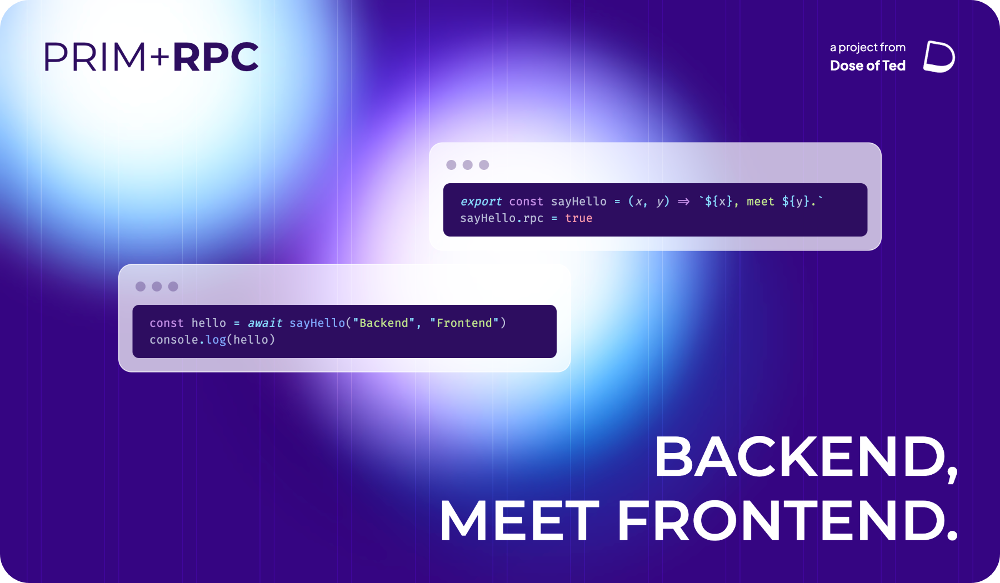

[^1]

**Prim+RPC is a bridge between JavaScript environments.** Call functions on the server as if they exist on the client,
without the wrappers. It's just JavaScript. You could bridge:

- Web server and client
- Two browser tabs
- Main thread and Web Worker
- Two entirely separate processes
- Or **any two separated JavaScript environments**

Prim+RPC is framework-agnostic (bring your own server _and_ client tools), fully-typed, lightweight, doesn't require a
compile-step, and is **loaded with features**:

- File handling
- Callback support
- Custom serialization
- Error handling
- Request batching
- HTML form handling
- Documentation generation
- Access control

Best of all, **if you know JavaScript, you already know how to use Prim+RPC**. If you want access to a function, just
call it: less setup, easier access, quicker development of your API.

Focus less on message transport and more on the message being sent, **with minimal setup**, using Prim+RPC:

**[📖 Read the Docs](https://prim.doseofted.me/) ∙ [💡 Try an Example](https://prim.doseofted.me/docs/examples) ∙
[⚙️ Setup in Project](https://prim.doseofted.me/docs/setup#installation) ∙ [🧑‍💻 Follow Author](https://doseofted.me/)**

## Contributions

<!-- prettier-ignore-start -->
> **Note**
> Prim+RPC is in early stages and is marching towards a [stable release](#release-plan). Support Prim+RPC by
> [starring the repository](https://github.com/doseofted/prim-rpc), sharing with others, and following for updates.
<!-- prettier-ignore-end -->

Happy to have you! Please see the [Contribution Guide](./CONTRIBUTING.md) to learn more. If you're only looking for how
to use the library, please see the [Documentation](https://prim.doseofted.me/).

## Issues & Security

- If you have any questions or are having trouble, feel free to open a
  [new discussion](https://github.com/doseofted/prim-rpc/discussions).
- For security-related issues, please refer to the [Security Policy](./SECURITY.md).
- If you discover a non-security issue with Prim+RPC, please
  [file a new issue](https://github.com/doseofted/prim-rpc/issues/new) so I can take a look!

## Release Plan

<!-- prettier-ignore-start -->
> **Warning**
> Prim+RPC is in **alpha** and it may be unstable. Keep up-to-date with the
> [latest releases](https://github.com/doseofted/prim-rpc/releases), report any
> [found security issues](https://github.com/doseofted/prim-rpc/security/advisories/new), and
> [participate in discussions](https://github.com/doseofted/prim-rpc/discussions) to help shape the future of the
> project!
<!-- prettier-ignore-end -->

Prim+RPC is planned to become stable by the end of 2023 (and is on track to be stable much sooner than that).

Prim+RPC Core, the framework-agnostic core of the project, will become stable first and will be released once the
default plugins are stable. Lastly, Prim+RPC's optional tooling (such as documentation generation) will become stable.
At this point, the alpha tag is planned to be removed. Once I am using Prim+RPC in production, a v1.0 will be released.

## Licenses

This project consists of three parts: Code, Documentation, and Assets:

**Code**: The Prim+RPC code libraries (RPC core, plugins, and tooling) are licensed under the
[Apache 2.0 license](./LICENSE.txt). You may find library source code in the [`/libs`](./libs/) folder of this project.
Assets, which may appear alongside Code, are excluded from this license.

**Documentation**: The documentation website and text are [proprietary](./LICENSE-DOCS.md). You may find documentation
in the [`/apps`](./apps/) folder of this project. Unauthorized usage of Documentation outside of fair use is strictly
prohibited.

**Assets**: The "Prim+RPC" name and logo as well as the "Dose of Ted" name and logo are
[proprietary](./LICENSE-ASSETS.md). Assets are excluded from all licenses, regardless of where they are located in the
project. Unauthorized usage of Assets outside of fair use is strictly prohibited.

[^1]:
    These badges report stats for [`@doseofted/prim-rpc`](https://www.npmjs.com/package/@doseofted/prim-rpc) on the npm
    registry.
