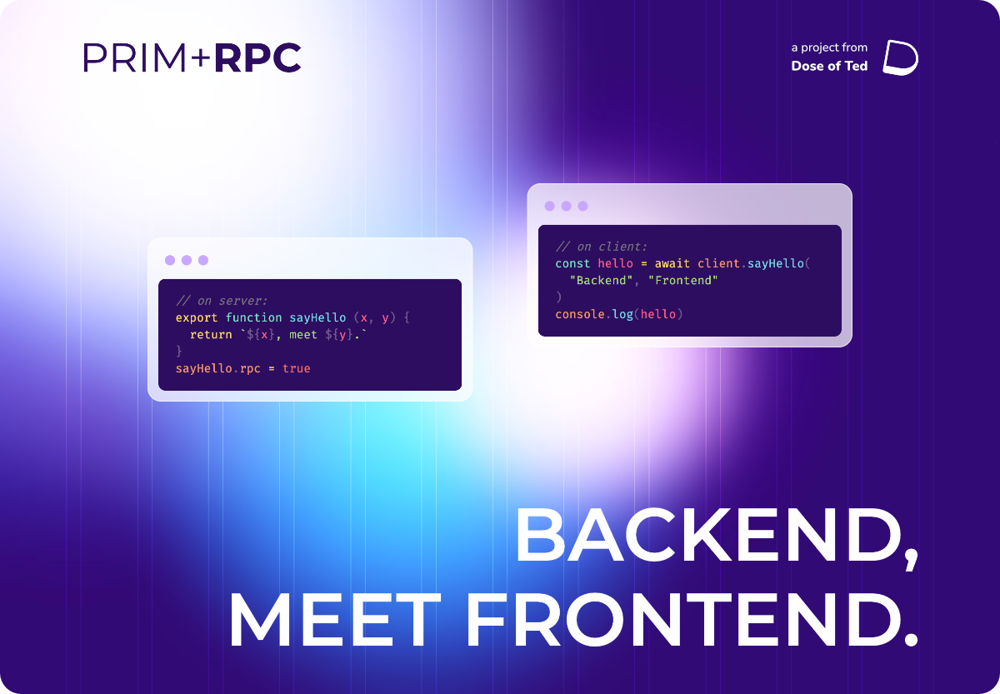

Prim+RPC is a bridge between JavaScript environments, without the extra boilerplate code. The primary use case of this
library is making plain function calls to a server from some client (RPC), as if that code had been written on the
client itself. The goal is to write plain JavaScript, or TypeScript if you prefer, and immediately invoke typed code
without verbose wrappers around the communication channel.

[Read the Documentation](./README.md)

## Development

See the [Documentation](./README.md) for usage instructions. These instructions refer to development of the project
itself.

Install [Task](https://taskfile.dev/) to easily run project commands defined in the [Taskfile](./Taskfile.yml). Run
`task dev:local` to configure local development environment.

If you prefer to work in Docker, configure the [`.env` file](./.env.example) and run `task compose:dev:up` (depends on
[Docker/Compose](https://docs.docker.com/get-docker/), [mkcert](https://github.com/FiloSottile/mkcert)).
