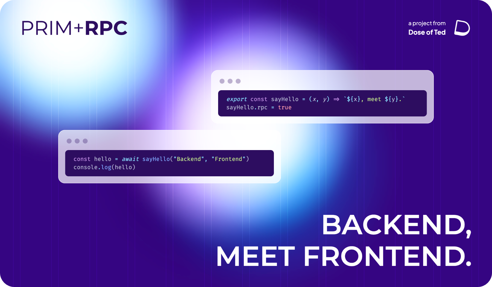

**Prim+RPC** is a bridge between JavaScript environments, without the extra boilerplate code. The primary use case of
this library is making plain function calls to a server from some client (RPC), as if that code had been written on the
client itself. The goal is to write plain JavaScript, or TypeScript if you prefer, and immediately invoke typed code
without verbose wrappers around the communication channel.

[Learn More](https://prim.doseofted.com/)
